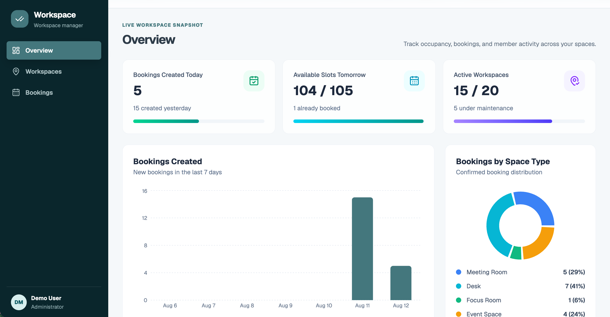
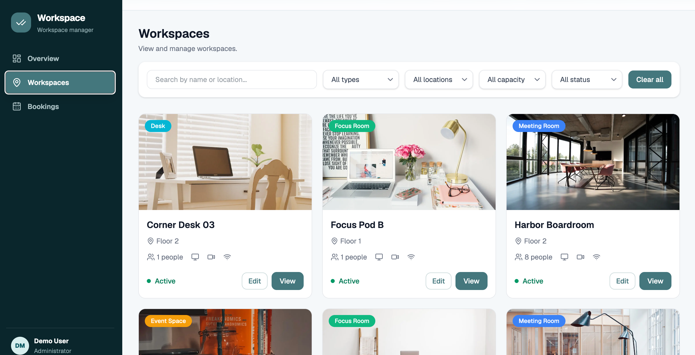
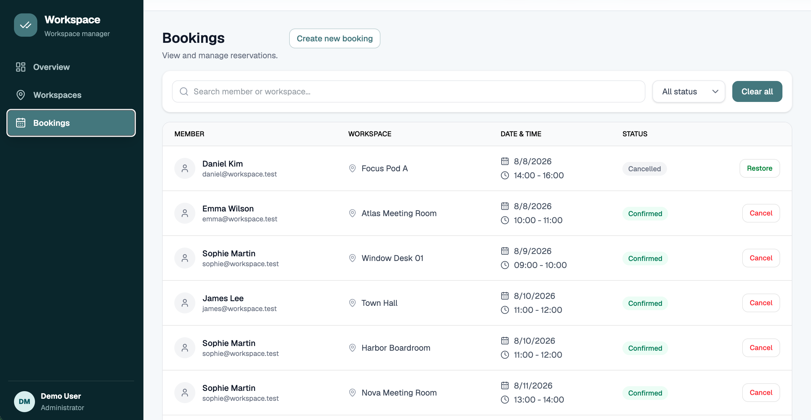

# Workspace Booking Dashboard

A full-stack dashboard for managing shared workspaces and bookings.

[Live Demo](https://workspace-dashboard-rho.vercel.app/bookings)

## Features

- URL-based workspace and booking filters
- Booking creation, cancellation and restoration
- Conflict checks across workspace, date and time slot
- Runtime API validation with Zod
- Database-driven metrics and charts

## Tech Stack

Next.js · TypeScript · PostgreSQL · Prisma · Zod · Tailwind CSS · shadcn/ui · Recharts

The demo uses seeded data and is intended for portfolio presentation.

## Screenshots

### Dashboard

### Workspaces

### Bookings

